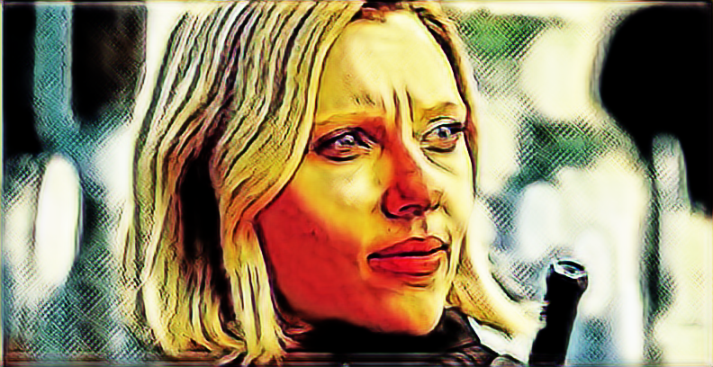

# CartoonGAN-TensorFlow2
## Abstract
This project is for software engineering course in Graduate Institute of Information Management, NTPU, by Jerry Chung and Wesley Chiu.

The original project were created by LeeMeng.(https://github.com/mnicnc404/CartoonGan-tensorflow)

We used the Marvel movie's trailer and Marvel comic to be our training dataset, and adjust the epoch parameters to 800.

The final model is in models folder, and the ouput images were in /testimage/output.

